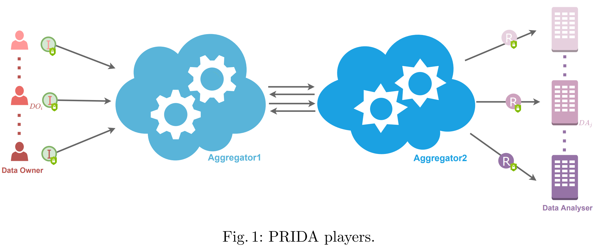
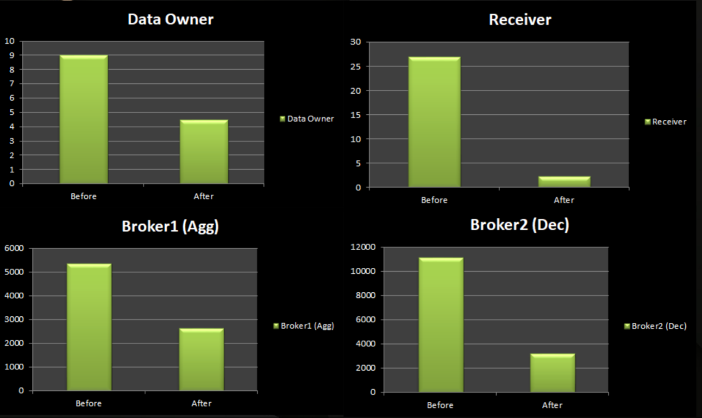

# PRIDA: PRIvacy-preserving data aggregation with multiple Data Analysers 
#### *<div align="center">By Beyza Bozdemir¹, Federica Germinario¹, Alessandro Pisani¹, Jakub Klemsa², and Melek Önen¹  </div>*
#### *<div align="center">  (¹EURECOM; ²Czech Technical University).</div>*
  
   
The code is written using **MK-TFHE library**.

This implementation is used to benchmark an extended version of the MK-TFHE library for the symmetric version of MK-FHE. 

The proposed scenario works for three Data Owners and two Receivers. Between them two Brokers, Aggregator and Decryptor are required.

### Quick installation of the proposed Protocol

```
git clone -b only_three_keys https://github.com/federicagerminario31/MK-TFHE/
```

After cloning the repository, do: 
```
cd MK-TFHE 
git submodule init
git submodule update 
mkdir build
cd build
cmake ../src -DENABLE_TESTS=on -DENABLE_FFTW=off -DENABLE_NAYUKI_PORTABLE=on -DENABLE_NAYUKI_AVX=on -DCMAKE_BUILD_TYPE=debug
make
```
To test (from build):
```
./test/PPanalytics-spqlios-fma
```

### Proposed Protocol: PRIDA based on MK-TFHE
The proposed protocol is a PRIDA implementation using a symmetric multi-key FHE. To deploy the protocol MK-TFHE (a symmetric multi-key FHE) is used.  
As far as keys are concerned each Receiver Rj shares one common key k<sub>j</sub> with all DOs and each DO establishes one pairwise key with each Aggregator;  
When Agg and Dec receive individual ciphertexts encrypted with different sets of keys, they partially decrypt them with the keys that they know and re-encrypt them with their unique key only known by themselves.  

PRIDA involves the following three parties which are represented in Fig. 1:  
  
- *Data Owner* DO owns some confidential input data and outsources this confidential data to the Brokers encrypted and secretly shared. DO also secretly defines which Receivers can access the aggregate result involving its input.  
- *Receiver* R obtains the data aggregation result over the inputs from many DOs in cleartext if authorised.  
- The two *Brokers* (*Aggregator* and *Decryptor*) are two non-colluding cloud servers which collect the encrypted data from many DOs, perform the data aggregation requested by Receivers, and send the results to the authorised Receiver. It is important to notice that the Aggregator is only in touch with the Data Owners and the Decryptor while the Decryptor can communicate only with the Aggregator and the Receivers.    

The details of multiplication over protected data are provided below:  

The index *i* ∈ {1, . . . , n} represents a Data Owner (DO) whereas index *j* ∈ {1, . . . , m} represents a Receiver, Rj (n and m are two natural numbers). An MK-FHE ciphertext is denoted with \[.].

**Phase 0: Key Generation.** Setup part executed by DO<sub>i</sub>, R<sub>j</sub>, Agg<sub>1</sub> and Agg<sub>2</sub>. 
1. Generation of symmetric shared key between data owner DO<sub>i</sub> with Agg<sub>1</sub> and DO<sub>i</sub> with Agg<sub>2</sub> : DO<sub>i1</sub> and DO<sub>i2</sub>.
2. Generation of Receiver R<sub>j</sub>, Agg<sub>1</sub> and Agg<sub>2</sub> specific keys.


**Phase 1: Deciding the authorised Receivers.** At the end of Phase 1, two Brokers can have the information of chosen Receivers who are able to obtain the data aggregation result. Basically, Brokers who get the shared choice vectors, compute simple additions over these shared choice vectors and finally find the number of DOs who chose R<sub>j</sub>. Therefore, both know who is authorised to receive the data aggregation result.  
In more details, Phase 1 consists of the following steps:  
*Each Data Owner*  
1. generates secret shares of its choice vector c<sub>i</sub> consisting choices of 0 or 1 for Receivers.
2. sends c<sub>i1</sub> to Broker1 and c<sub>i2</sub> to Broker2.
  
*Each Broker*  
1. After receiving shares of the choice vectors for R<sub>j</sub>s, adds these shares without any interaction with the other Broker.
2. This partial sum is sent to the other Broker.
3. both Brokers bring together the partial sums to observe whether Receiver R<sub>j</sub> is authorised. If the total sum is bigger than or equal to *threshold t*, Brokers operates the data aggregation over the private data for Receiver R<sub>j</sub>. Otherwise, the two non-colluding Brokers stop processing for R<sub>j</sub>.  
  
**Phase 2: Computing the data aggregation result.** Phase 2 is simply the componentwise multiplication of the choice vector and the shared-encrypted input data vector using Beaver’s triplets. Then, the multiplication result vectors of DOs are componentwisely added to see the data aggregation result vector.
The details of Phase 2 are represented as follows:  
*Each DO*
1. generates secret shares of its private data vector d<sub>i</sub> for Receivers.
2. After secret shares’ generation, each component of shared data vectors is encrypted with the public keys of R<sub>j</sub> and the keys shared with the two Brokers (keys DO<sub>i1</sub> and DO<sub>i2</sub>).
3. To be used for Beaver’s triplets, DO generates secret shares of random numbers α<sub>i</sub> and β<sub>i</sub> where γ<sub>i</sub> = α<sub>i</sub> ∗ β<sub>i</sub>. (α<sub>i</sub> = α<sub>i1</sub> + α<sub>i2</sub> and β<sub>i</sub> = β<sub>i1</sub> + β<sub>i2</sub>).
4. sends the shares of \[d<sub>i</sub>], c<sub>i</sub>, γ<sub>i</sub>, α<sub>i</sub>, and β<sub>i</sub> to Broker1 and Broker2.

After receiving all data from DOs, *Broker1 and Broker2* perform the following steps to obtain thedata aggregation result over protected DOs’ private data.  
  
0. Unmask the known secret keys of DO<sub>ik</sub> and Agg<sub>k</sub> to change the part of \[d<sub>ik</sub>] related to the DO<sub>ik</sub>’s secret key to the Agg<sub>k</sub>’s secret key. Agg1 and Agg2 end up with samples encrypted with the keys of R<sub>j</sub>, Agg<sub>1</sub>, Agg<sub>2</sub>.  
1. Each Broker computes \[ϵ<sub>ik</sub>] with the addition of \[d<sub>ik</sub>] and α<sub>ik</sub>, and δ<sub>ik</sub> with the addition of c<sub>ik</sub> and β<sub>ik</sub>, where k = 1 or 2.
2. Each Broker sends \[ϵ<sub>ik</sub>] and δ<sub>ik</sub> to the other Broker.
3. Each Broker obtains \[ϵ<sub>i</sub>] and δ<sub>i</sub> making use of \[ϵ<sub>i1</sub>] and \[ϵ<sub>i2</sub>], and δ<sub>i1</sub> and δ<sub>i2</sub>, respectively.
4. Each Broker computes γ<sub>ik</sub> + \[d<sub>ik</sub>] ∗ δ<sub>i</sub> + c<sub>ik</sub> ∗ \[ϵ<sub>i</sub>], k = 1 or 2.
5. After this step, Broker1 sends 4 to Broker2.
6. After receiving 5, Broker2 finds γi + \[d<sub>i</sub>] ∗ δ<sub>i</sub> + c<sub>i</sub> ∗ ϵ<sub>i</sub>.
7. Then, Broker2 subtracts \[ϵ<sub>i</sub>] ∗ δ<sub>i</sub> from the previous result.
8. Broker2 obtains \[d<sub>i</sub>] ∗ c<sub>i</sub> for only one DO.
9. Broker2 adds all multiplication result vectors to find the data aggregation results for Receivers.  
Finally, Broker2 has the data aggregation vector \[s<sub>j</sub> ] which is equal to the summation (for *i* which goes from 1 to n) of \[d<sub>i</sub>] ∗ c<sub>i</sub>.
  
**Phase 3: Decryption of the data aggregation result.** The final steps of the data aggregation is the decryption as follows:
1. Broker2 sends the data aggregation vector \[s<sub>j</sub> ] to Broker1.
2. Broker2 partially decrypts \[s<sub>j</sub> ] for the authorised Receivers.
3. Like Broker2, Broker1 partially decrypts \[s<sub>j</sub> ] for the authorised Receivers.
4. Broker1 sends this partially decrypted data aggregation vector \[s<sub>j</sub> ] to Broker2.
5. Broker2 sends the data from 2 and 3 to authorised Receiver R<sub>j</sub> .
6. Finally, *authorised R<sub>j</sub>* firstly partially decrypts its part, merges all partial decryptions of \[s<sub>j</sub> ], and receives the data aggregation result.

### MK-TFHE Improvements
First of all to implement our protocol using MK-TFHE library we had many issues to target. Firstly, MK-TFHE differently from the TFHE library is only a *proof-of-concept* and as such only the basic *NAND* gate was implemented, tested and benchmarked. Since our protocol needs as basic operations additions and multiplications we had to implement and test all the missing gates.  
These gates were the building blocks for more complex logic circuits like the full_adder, full_subtracter, shift_left and many more which are needed to achieve our goals.  
  
Another challenging issue is that while in the MK-TFHE proposed paper it seemed that it was possible to perform partial encryption and partial decryption in the proposed implementation only two functions were provided which allowed to encrypt and decrypt with the Multi-key data structure for all the involved parties. To this extent a modification to the existing implementation was needed in order to achieve a particular masking and unmasking operation for a party p. 

Here are listed in more detail the **Four** main improvements to the existing library:
1) PRELIMINARY. We have implemented some useful gates: 
    - All basic gates present in TFHE library which were not present in MK-TFHE (*OR*, *AND*, *XOR*, *NOT*, *COPY*, *CONSTANT*, ...)
    - Complex ones like *Subtractor*, *XOR3*, *2OF3*, *Shift_Left*, ...
2) FULL ADDER. We have implemented a *full_adder_v2* using the gates XOR3 and 2OF3
3) MULTIPLICATION. We have implemented a *multiplier_v2* using shift left operations and additions
4) MK STRUCTURE. Improved the masking and unmasking operation to use data structures of maximum three keys.
    - *MKlweFirstPartyEncrypt*: at p-th block of mask, generate a random mask and add to the masked message at other blocks of mask, fill zeros
    - *MKlweNthPartyEncrypt*: Add p-th party mask
    - *MKlweNthPartyUnmask*: remove p-th party mask
    - *MKlweLastPartyDecrypt*: decrypt by removing the last party's mask  

The final improvement is aimed at reducing as maximum as possible the number of keys:
- Each Broker needs to store 4 keys 1 for each DO and 1 which will be replacing the others
- Each data will need (at most) 3 layers of encryption only 


The code for these new functions can be found in [MK-TFHE/src/libtfhe/mkTFHEfunctions.cpp](https://github.com/federicagerminario31/MK-TFHE/blob/master/src/libtfhe/mkTFHEfunctions.cpp). The associated prototyped instead can be found in [MK-TFHE/src/include/mkTFHEfunctions.h](https://github.com/federicagerminario31/MK-TFHE/blob/master/src/include/mkTFHEfunctions.h)


### Benchmark Results (and discussion)
As a result of the improvements done on the MK-TFHE library we can see how the benchmark took benefit from the various improvements listed before.  
  
   
 
In the table below it can be found the Performance results for each player of PRIDA (computation time displayed in s).   
  
|*Protocols*   | *Data Owner*  |  *Receiver* | *Aggregator*  |  *Decryptor* |
|---|---|---|---|---|
| Protocol 2 with MK-TFHE  |  4.452 | 2.275  | 2632.251  |  3160.709  |
  
It is good to highlight that the difference in performances (even if only slightly different) between the two brokers are due to the higher number of steps performed by the Decryptor with respect to the Aggregator in the Beaver's triplets phase.
  
It can be noticed that when we apply improvements 2, 3 and 4 listed above, we obtain a better result. In fact in all cases we do have an improvement of at least 50% with respect to the plain MK-TFHE implementation.  
However the protocol is still very slow compared with the other versions of PRIDA using other cryptographic techniques like: 
- asymmetric multi-key fully homomorphic encryption (MK-FHE), 
- threshold fully homomorphic encryption (Th-FHE).  

It is important to notice however that the version of the protocol using as a cryptographic technique symmetric multi-key fully homomorphic encryption (i.e., MK-TFHE) is inherently slow due to the usage of low level implementation of the Homomorphic encryption.  

Please notice that in terms of FFT (Fast Fourier Transform) libraries it is not casual the choice of SPQLIOS_FMA for compilation because it is the one that provides better results in terms of timing. Below we have listed a ranking of the FFT libraries from the faster to the slowest one:  
1) SPQLIOS_FMA: compiles libtfhe-spqlios-fma.a, using tfhe's dedicated fma assembly version for FFT computations
2) SPQLIOS_AVX: compiles libtfhe-spqlios-avx.a, using tfhe's dedicated avx assembly version for FFT computations
3) NAYUKI_AVX: compiles libtfhe-nayuki-avx.a, using the avx assembly version of nayuki for FFT computations
4) NAYUKI_PORTABLE: compiles libtfhe-nayuki-portable.a, using the fast C version of nayuki for FFT computations

# MK-TFHE
Multi-Key Homomophic Encryption from TFHE


MK-TFHE is a **proof-of-concept** (_please do not expect maintenance or support for this code_) implementation of a multi-key version of TFHE. The code is written on top of the TFHE library (https://tfhe.github.io/tfhe/). 

MK-TFHE is described in the paper "Multi-Key Homomophic Encryption from TFHE" by Hao Chen, Ilaria Chillotti, Yongsoo Song (https://eprint.iacr.org/2019/116). 

We report below the TFHE readme, giving details on the original library and instructions for the dependencies and installation. We refer to their webpage for more details. 

### Quick installation of MK-TFHE

After cloning the repository, do: 
```
cd MK-TFHE 
git submodule init
git submodule update 
mkdir build
cd build
cmake ../src -DENABLE_TESTS=on -DENABLE_FFTW=off -DENABLE_NAYUKI_PORTABLE=off -DENABLE_NAYUKI_AVX=off -DCMAKE_BUILD_TYPE=release
make
```

To test (from build):
```
./test/testMKbootNAND_FFT_v2-spqlios-fma
```


* * *


# tfhe
Fast Fully Homomorphic Encryption Library over the Torus

**version 1.0** -- *first release date: 2017.05.02*

**version 1.0-rc1** -- *first pre-release date: 2017.04.05*

**version 0.1** -- *Proof of concept release date: 2016.08.18*

TFHE is open-source software distributed under the terms of the Apache 2.0 license. 
The scheme is described in the paper "Faster fully homomorphic encryption: Bootstrapping in less than 0.1 seconds" presented at the IACR conference Asiacrypt 2016 by Ilaria Chillotti, Nicolas Gama, Mariya Georgieva, Malika Izabachène.


### Description 

The TFHE library implements a very fast gate-by-gate bootstrapping, based on [CGGI16]. Namely, any binary 
gate is evaluated homomorphically in about 13 milliseconds on a single
core which improves [DM15] by a factor 50, and the mux gate takes about 26 CPU-ms (or 13ms on 2 cores). 

The library implements a Ring-variant of the GSW [GSW13]
cryptosystem and makes many optimizations described in [DM15] and [CGGI16]. 

It also implements a dedicated Fast Fourier
Transformation for the anticyclic ring R[X]/(X^N+1), and uses AVX, AVX2 and FMA assembly vectorization instructions. 
The default parameter set achieves at least 110-bit of cryptographic security, based on ideal lattice assumptions.

From the user point of view, the library can evaluate a net-list of binary gates homomorphically at a rate of about 50 gates per second per core, without decrypting its input. It suffices to provide the sequence of gates, as well as ciphertexts of the input bits. And the
library computes ciphertexts of the output bits.

Unlike other libraries, TFHE has no restriction on the number of gates or on their composition. This makes the library usable with either
manually crafted circuits, or with the output of automated circuit generation tools. For TFHE, optimal circuits have the smallest possible number of gates, 
and to a lesser extent, the possibility to evaluate them in parallel. 


### Dependencies 


The library interface can be used in a regular C code. However, to compile the core of the library you will need a standard C++11 compiler.
Currently, the project has been tested with the g++ >= 5.2 compiler and clang >=3.8 under Linux, as well as clang under MacOS. In the future, we plan to extend the compatibility to other compilers, platforms and operating systems.

At least one FFT processor is needed to run the project:

* The default processor comes from Project Nayuki, who proposes two implementations of the fast Fourier transform - one in portable C, and the other using the AVX assembly instructions.
This component is licensed under the MIT license, and we added the code of the reverse FFT (both in C and in assembly). Original source: https://www.nayuki.io/page/fast-fourier-transform-in-x86-assembly
* we provide another processor, named the spqlios processor, which is written in AVX and FMA assembly in the style of the nayuki processor, and which is dedicated to the ring R[X]/(X^N+1) for N a power of 2.
* We also provide a connector for the FFTW3 library: http://www.fftw.org. With this library, the performance of the FFT is between 2 and 3 times faster than the default Nayuki implementation. However, you should keep in mind that the library FFTW is published under the GPL License. If you choose to use this library in a final product, this product may have to be released under GPL License as well (other commercial licenses are available on their web site)
* We plan to add other connectors in the future (for instance the Intel’s IPP Fourier Transform, which should be 1.5× faster than FFTW for 1D real data)


### Installation

To build the library with the default options, run ```make``` and ```make install``` from the top level directory of the TFHE project. This assumes that the standard tool cmake is already installed on the system, and an
up-to-date c++ compiler (i.e. g++ >=5.2 or clang >= 3.8) as well.
It will compile the shared library in optimized mode, and install it to the ```/usr/local/lib``` folder.

If you want to choose additional compile options (i.e. other installation folder, debug mode, tests, fftw), you need to run cmake manually and pass the desired options:
```
mkdir build
cd build
cmake ../src -DENABLE_TESTS=on -DENABLE_FFTW=on -DCMAKE_BUILD_TYPE=debug
make
```
The available options are the following:

| Variable Name          | values           | 
|------------------------|-------|
| CMAKE_INSTALL_PREFIX   | */usr/local* installation folder (libs go in lib/ and headers in include/) | 
| CMAKE_BUILD_TYPE       | <ul><li>*optim* enables compiler's optimization flags, including native architecture specific optimizations</li><li>*debug* disables any optimization and include all debugging info (-g3 -O0)</li> | 
| ENABLE_TESTS           | *on/off* compiles the library's unit tests and sample applications in the test/ folder. To enable this target, you first need to download google test sources: ```git submodule init; git submodule update``` (then, use ```ctest``` to run all unittests) | 
| ENABLE_FFTW            | *on/off* compiles libtfhe-fftw.a, using FFTW3 (GPL licence) for fast FFT computations |
| ENABLE_NAYUKI_PORTABLE | *on/off* compiles libtfhe-nayuki-portable.a, using the fast C version of nayuki for FFT computations |
| ENABLE_NAYUKI_AVX      | *on/off* compiles libtfhe-nayuki-avx.a, using the avx assembly version of nayuki for FFT computations |
| ENABLE_SPQLIOS_AVX     | *on/off* compiles libtfhe-spqlios-avx.a, using tfhe's dedicated avx assembly version for FFT computations |
| ENABLE_SPQLIOS_FMA     | *on/off* compiles libtfhe-spqlios-fma.a, using tfhe's dedicated fma assembly version for FFT computations |

### References

[CGGI16]: I. Chillotti, N. Gama, M. Georgieva, and M. Izabachène. Faster fully homomorphic encryption: Bootstrapping in less than 0.1 seconds. In Asiacrypt 2016, pages 3-33.

[DM15]:   L. Ducas and D. Micciancio.  FHEW: Bootstrapping homomorphic encryption in less than a second.  In Eurocrypt 2015, pages 617-640.

[GSW13]:  C. Gentry, A. Sahai, and B. Waters. Homomorphic encryption from learning with errors:  Conceptually-simpler,  asymptotically-faster,  attribute-based. In Crypto 2013, pages 75-92


